The goal of this article is to provide examples and strategies for making selections in your editor, (mostly) without using the mouse.

We will also take a deep dive into Multi-line editing.

 
 
 
 

# Beginner level 💻

## `Shift + Arrow Key` modifies selection

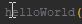 
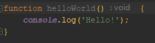

## `Ctrl + Arrow Key` skips to end of word

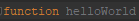

## `End` skips to end of line

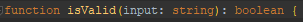

## `Home` skips to first character of a line
_pressing home again skips to begining of a line_ 

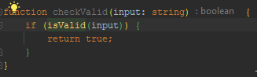

# Intermediate Level 🪄
Leverage `Shift` with other controls to make selections more efficiently

## `Shift + Ctrl + Arrow Key` selects full words

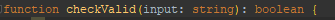

## `End → Shift + Home` OR `Home → Shift + End` selects full lines 
On any line, from any position, press `home` and then `shift + end` to highlight the entire line 
_you can also do the reverse, `end` and then `shift + home`_

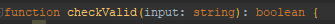

## `Ctrl + W` Smart selection expansion
`Ctrl + W` will expand your selection outward, starting with the word, then expanding outwards to cover entire strings, expressions, functions etc.

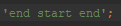

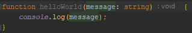

This is especially useful for long strings such as import lines

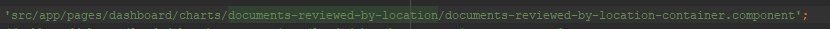

# Advanced Level 🚀
Bringing it all together with <b>multi-line</b> editing

# Part 1 - Initiate Multiline Editing
There are a few ways to begin multi-line editing:

## 1. Double Tap & Hold `Ctrl` + `Arrow Keys`
- Press control twice rapidly
- On the second press, do not release control
- Move arrow keys up and down to add or remove additional cursors
- Release control afterwards

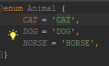

## 2. Middle Mouse & Drag
Very similar to 1, just with a mouse.
- Useful for quickly selecting multiple entries that are all tabbed one line after another

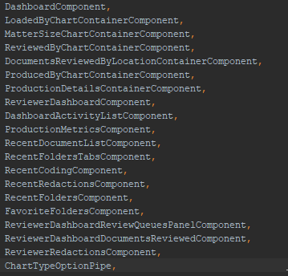

## 3. `Alt + Shift + Click` 
Useful for selecting repeating coding blocks that are separated

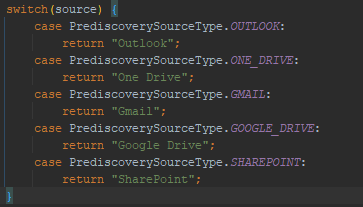

## 4. `Ctrl + F`
You can add also cursors with the Ctrl F window, but you _really_ need to know what you're doing

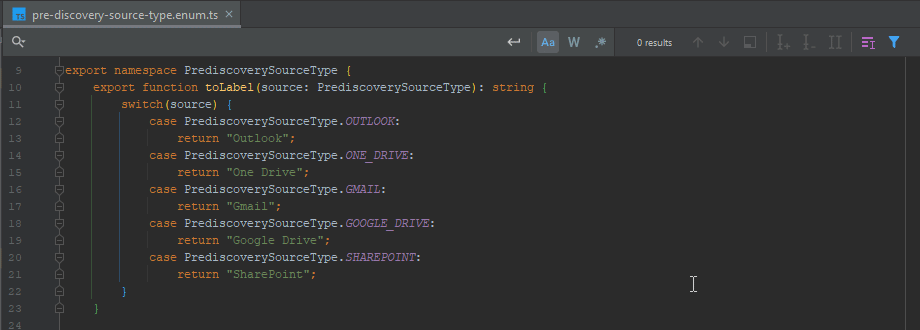

# Part 2 - Getting the most out of multi line editing
Multiline editing can save you a ton of time writing code with patterns
- switch blocks
- refactoring dependencies

## Example 1 - Switch Blocks From Enum

<iframe width="420" height="315" src="../assets/img/mle-5.mp4" frameborder="0" allowfullscreen></iframe>

There's a lot to unpack in this example so let's break it down...

- Middle click + drag to select all enum keys
- `Ctrl + Left arrow` (or `home`) to go to the beginning of the line
- `Ctrl + Shift + Right Arrow` to select the entire enum (`Ctrl + W` would work here too)
- `Ctrl + C` to copy the selection
- click into the switch
- `Ctrl + V` to paste the selection
- double tab `Ctrl` + hold then up arrow to add cursors on each line
- `home` to go to the beginning of each enum
- type out the repeated `case` code on each line
- `end` to go to the end of the line
- type `:` to complete the case statement
- `enter` to create a new line at each cursor
- type out repeated code on each line `return toTitleCase();`
- move cursors up to select the entire enum qualifier with each cursor
- `Ctrl + C` to copy each enum
- move down to the parenthesis
- `Ctrl + V` to paste each copied enum into their respective line
- `end` to quickly add a semicolon at the end of each line

## Example 2 - Refactoring Angular DI

<iframe width="420" height="315" src="../assets/img/mle-6.mp4" frameborder="0" allowfullscreen></iframe>

The breakdown of this example:
- Middle click + drag to select all lines
- press `home`
- press `Shift + end`
- press `Ctrl + X` (cut)
- Delete the constructor as it's no longer needed
- press `Ctrl + V` (paste)
- press `home`
- double tap + hold `Ctrl`, up arrow to select all lines
- press `Ctrl + Right Arrow`
- type `readonly`
- press `Ctrl + Right Arrow`
- type `= inject(`
- press `end`
- type `);`
- import `inject`
- done
